# Ultimate Countries

An Anki deck of the world's countries, territories and major cities, and the pipeline that builds it.

**Get the deck:** [on AnkiWeb](https://ankiweb.net/shared/info/164142051), or download `ultimate_countries.apkg` from
the [latest release](https://github.com/AminFadaee/Ultimate-Countries/releases/latest).

**Ultimate Places**, the companion deck of continents, seas, mountains, rivers, deserts, rainforests, regions and
landmarks: [on AnkiWeb](https://ankiweb.net/shared/info/216393289), or `ultimate_places.apkg` from the same release.
See [Ultimate Places](#ultimate-places) below.

It is inspired by [Ultimate Geography](https://github.com/anki-geo/ultimate-geography), the deck that got me excited
about learning geography. Ultimate Countries covers every country and territory with a permanent population: 247 in
all, each with its flag, map and capital, plus demonyms, languages, currencies, religions, population, government and
city maps.

Every value comes from public sources through code. There are no hand-written overrides, so the whole dataset can be
rebuilt on any day to pick up changes (new currencies, new members of an organisation, updated population figures).

## The deck

Two note types, with each kind of question in its own subdeck.

### Country notes

| Subdeck | Question | Answer | Also shown |
|---|---|---|---|
| Capitals | Capital: France | Paris | Number of capitals, when there are several |
| Capitals | Capital of: Paris | France | |
| Flags | the flag | France | |
| Maps | the locator map | France | |
| Demonyms | Demonym: France | French | Female form, other demonyms |
| Languages | Language: Switzerland | German, French, Italian, Romansh | Other languages and the share of people who speak them |
| Currencies | Currency: Panama | Panamanian balboa | Other currencies in use |
| Religions | Religion: Malta | Catholicism | Whether it is the state religion or the largest one, and the breakdown |
| Population | Population: Nigeria | ~238 million (2025) | Exact figure |
| Government | Government: Germany | Federal parliamentary republic | Full description (sovereign states only) |

Every card also shows the region and the country's notable cities.

A card is only created when its data exists: Antarctica has no language card and territories have no government card.

<p>
  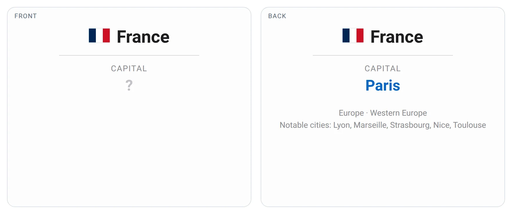
  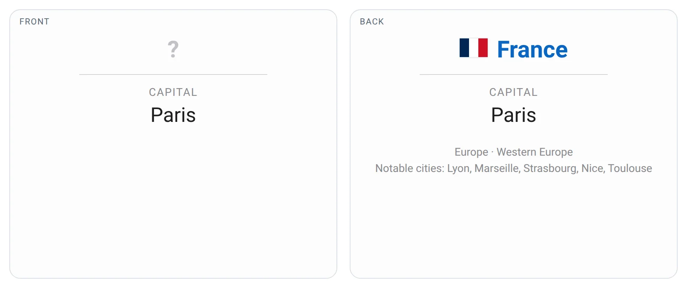
  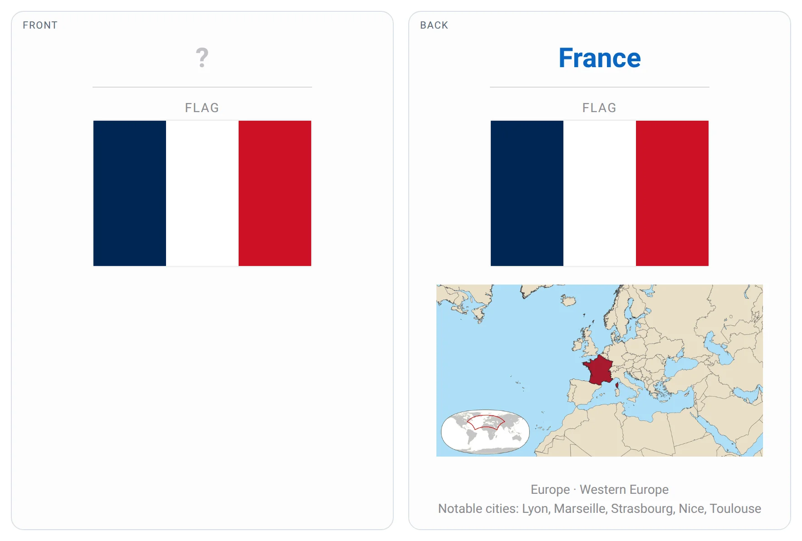
  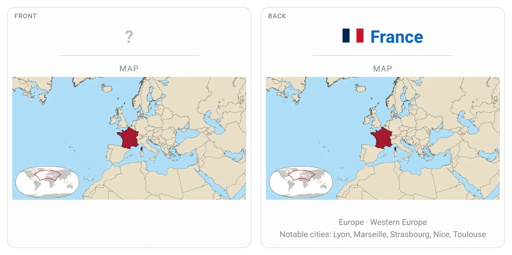
  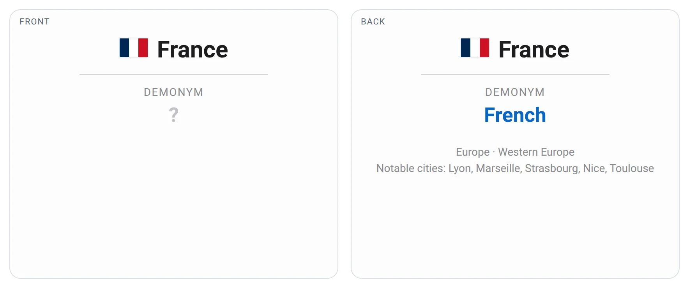
  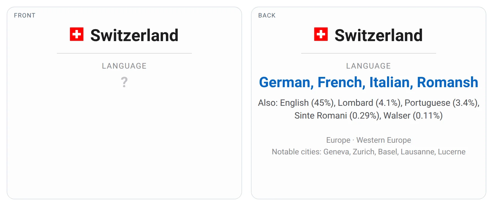
  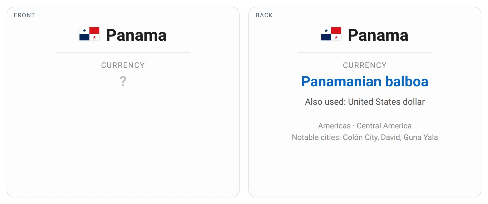
  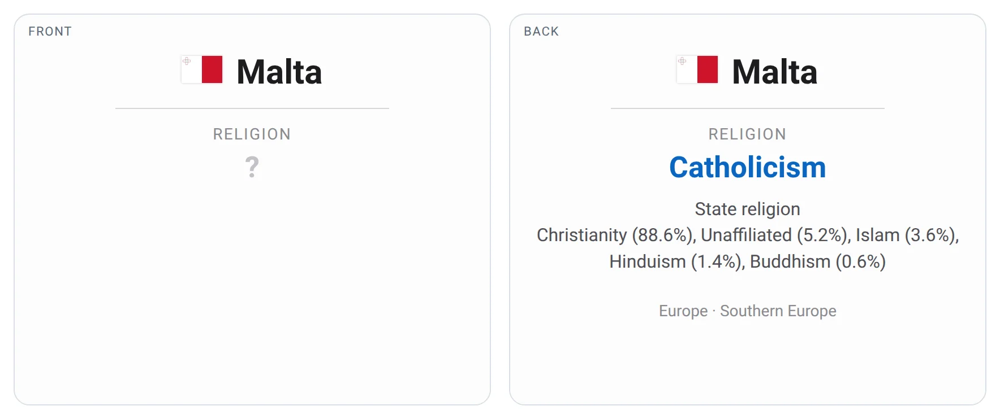
  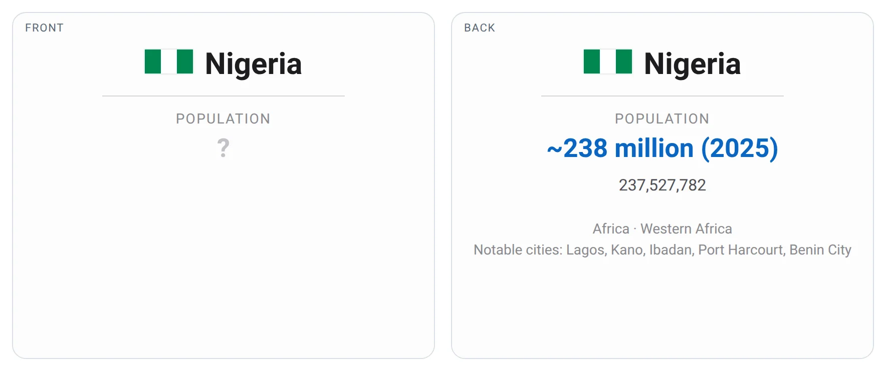
  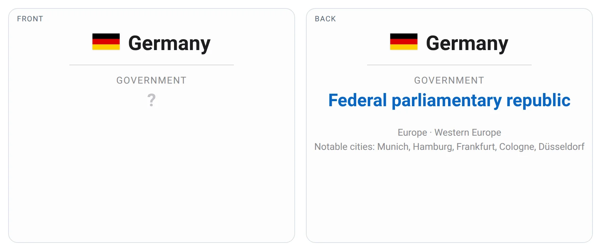
</p>

### City notes

Capitals and notable cities, each with its own locator map:

| Question | Answer |
|---|---|
| the city's locator map | City and country |
| Country: Lyon | France (not asked for capitals, which the capital cards already cover) |

<p>
  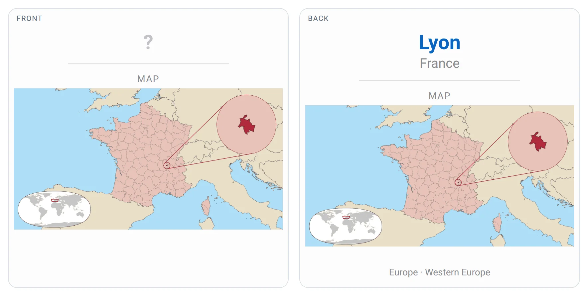
  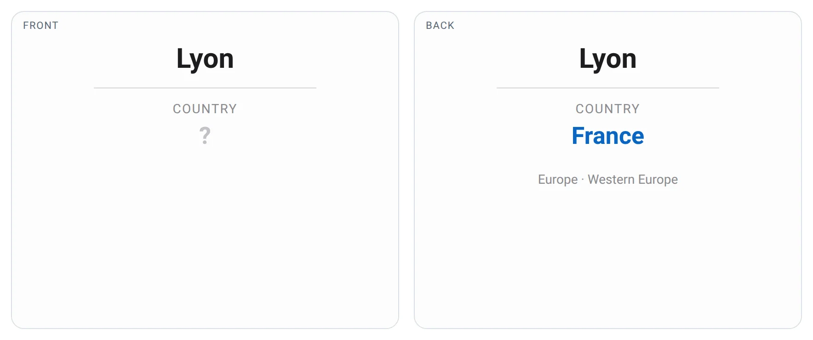
</p>

### Tags

Notes are tagged so you can filter or suspend groups of them:

- region and subregion: `UC::Asia`, `UC::Western_Europe`
- status: `UC::Sovereign`, `UC::Territory`, `UC::Disputed`
- memberships: `UC::European_Union`, `UC::NATO`, `UC::ASEAN`, …
- currency: `UC::Euro`, `UC::West_African_CFA_franc`, …
- cities: `UC::City`, `UC::Capital`

To skip a kind of question, suspend its subdeck rather than deleting it: deleted cards come back when you import an
update.

## Ultimate Places

A second deck about the world's geography beyond borders: 386 places, each drawn on a map with its real outline,
coloured by kind (snowy white for mountains, orange for deserts, blue for water, green for lowlands and so on).

**Get the deck:** [on AnkiWeb](https://ankiweb.net/shared/info/216393289), or download `ultimate_places.apkg` from the
[latest release](https://github.com/AminFadaee/Ultimate-Countries/releases/latest).

### Cards

| Question | Answer |
|---|---|
| the map, with the kind of place (MOUNTAIN RANGE, DESERT…) | its name, with countries, one fact and, for landmarks, the city and when it was built |
| a photo (mountains, volcanoes, waterfalls, canyons, reefs, rainforests, canals and landmarks) | its name, kind, map and the same details |

<p>
  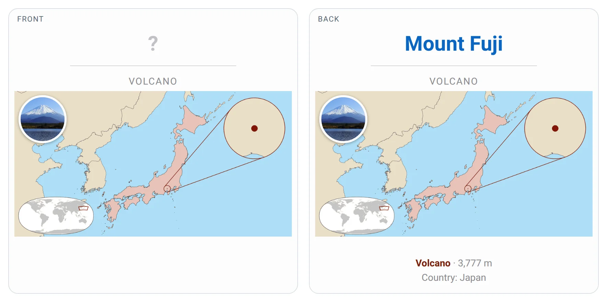
  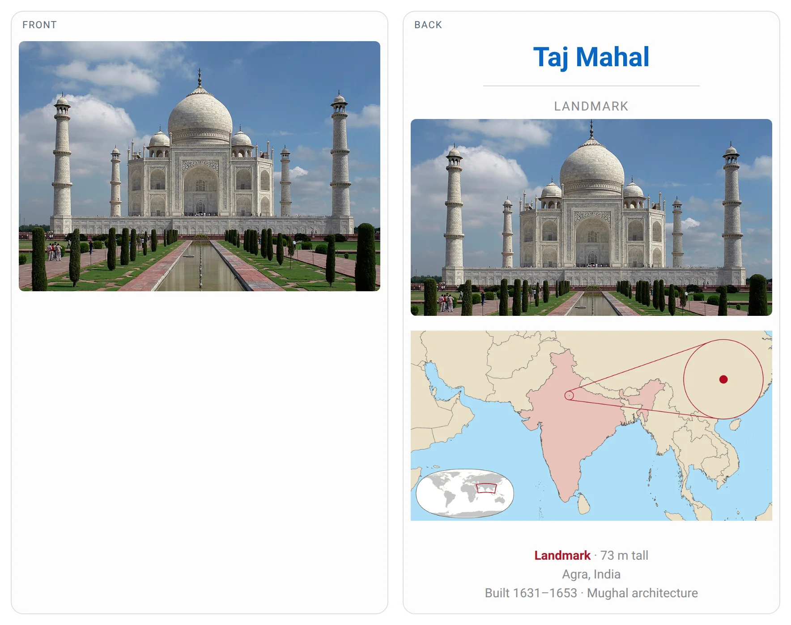
</p>

### Everything in one deck

Ultimate Places has no subdecks. Every note is tagged with its kind and continent, for example `UP::Volcano`,
`UP::Mountain_range`, `UP::Africa` or `UP::World_Heritage`. To study one kind at a time, create a filtered deck:

1. Tools → Create Filtered Deck
2. Search for `deck:"Ultimate Places" tag:UP::Volcano` (or any other tag, or several joined with `or`)
3. Build

To leave a kind out for good, open the Browser, search for its tag and suspend the cards.

### Kinds and sources

| Kind | Source | Rule |
|---|---|---|
| Continents | Natural Earth | All of them |
| Oceans and seas | Marine Regions (the IHO sea areas), Natural Earth for seas IHO doesn't cover (Caspian) | Linked to Wikidata; halves and basins merge into the whole sea, and marginal seas into the sea they belong to |
| Mountain ranges, deserts, plateaus, plains, basins, valleys, deltas, wetlands, peninsulas, isthmuses | Natural Earth physical regions | Natural Earth's importance rank, plus enough Wikipedia coverage to be well known |
| Rivers, lakes, reefs | Natural Earth | Same as above |
| Mountains and volcanoes | Natural Earth peaks and Wikidata | Well known; volcanoes by their Wikidata type |
| Waterfalls, canyons, canals | Wikidata, with shapes from Natural Earth and OpenStreetMap | The best known of each kind |
| Rainforests | RESOLVE Ecoregions 2017 | Large continuous blocks of tropical moist forest, named after the forest or the basin or island they cover |
| Regions | Wikipedia | Regions whose Wikipedia infobox lists their countries (Scandinavia, the Middle East…), drawn from those countries |
| Landmarks | Wikidata | World Heritage sites and famous structures that are buildings, monuments or archaeological sites; living cities are left out |
| Lines | Natural Earth | The Equator, the tropics, the polar circles and the International Date Line, plus the Prime Meridian |

Countries are computed from the shapes: the countries that hold a share of an area, border a sea or lake, or are
crossed by a river. Facts (heights, lengths, areas) come from Wikidata, converted to metric; build dates and cultures
from the Wikipedia infobox; photos from Wikimedia Commons.

## How the data is chosen

| Field | Source | Rule |
|---|---|---|
| Country list | ISO 3166, restcountries | Every entity with an ISO 3166 code, plus sovereign states without one (Kosovo, Abkhazia…), keeping only places with a permanent population: listed in Wikipedia's population list, or at least 2,250 people |
| Name | Wikipedia | The title of the country's English Wikipedia article, which follows the most common English name |
| Demonym, currencies, government label, capitals | restcountries | Demonym spelling cross-checked with Wikidata |
| Capital cities, notable cities, city populations | Wikidata, GeoNames | Notable cities rank on fame (Wikipedia sitelinks) and size, skipping suburbs and villages |
| Population | World Bank | Latest figure, at most 5 years old; restcountries otherwise |
| Official languages | Wikipedia, Wikidata | National and regional status from Wikipedia's list of official languages |
| Spoken languages | Unicode CLDR | Includes second-language speakers |
| State religion | Wikipedia | Current states with a state religion |
| Religious composition | Pew Research Center | 2020 figures; places under 100,000 people are not covered |
| Main currency | ISO 4217 | A real ISO currency, preferring the country's own |
| Government form | restcountries, Wikidata | Short form derived from the full label by keyword rules |
| Memberships | restcountries, Wikidata | Wikidata adds only recent joins that both sides of the membership record |
| Maps | Natural Earth, OpenStreetMap | Rendered locally |

When sources disagree and no rule settles it, the field is left empty rather than guessed.

## Building it yourself

Requires Python 3.13 and [uv](https://docs.astral.sh/uv/).

```sh
uv sync
echo 'RESTCOUNTRIES_API_KEY=your-key' > .env
```

```sh
uv run geography collect      # fetch data, flags, city lists and render maps into data/
uv run geography check        # accuracy against the reference set, anomalies, card coverage
uv run geography deck         # build build/ultimate_countries.apkg
uv run geography places       # collect places, photos and maps into data/places/
uv run geography places-deck  # build build/ultimate_places.apkg
uv run geography samples      # render the sample cards in docs/samples/ from the built decks
```

The first `collect` downloads several hundred MB of source data and renders about 1,150 maps, which takes a few hours.
Later runs reuse the caches.

Useful options:

- `collect --skip-maps` refreshes the data only
- `collect --refresh-cities` re-ranks notable cities, which are otherwise refreshed every 30 days
- `collect --rerender-maps` redraws every map
- `collect --workers N` sets the number of parallel map renderers (default 4)
- `check --details` lists every failure and anomaly
- `places --rerender-maps` redraws every place map

`place` renders a map for any single place, independent of the deck:

```sh
uv run geography place "Bruges" --country Belgium --borders regions
```

## Releasing

Releases are built by GitHub Actions from the committed data, flags and maps.

```sh
uv run geography collect
uv run geography check
uv run geography places
git add data
git commit -m "Update data"
git push
git tag v$(date +%Y.%m.%d)
git push origin v$(date +%Y.%m.%d)
```

Versions are dates, so the version says how fresh the data is. Pushing the tag builds `ultimate_countries.apkg` and
`ultimate_places.apkg` and publishes them as a release under that tag.

## Quality checks

`reference/countries.json` holds hand-checked answers for 46 countries. It is only used to measure accuracy and never
feeds into the data. `geography check` scores every field against it, scans all entries for anomalies (duplicate
languages, capitals smaller than they should be, contradictory flags) and reports how many cards each field produces.

## Repository layout

```
src/geography/
  main.py           command line
  collect.py        the collection pipeline
  sources/          one module per data source
  languages.py      merging official and spoken languages
  cards.py          turns a country into card answers
  deck.py           builds the Anki package
  render.py, maps.py, detail.py
                    locator maps
  quality.py        reference scoring and anomaly scan
  samples.py        renders the sample cards shown in this README
  features/         Ultimate Places: selection rules, maps and deck
data/
  countries/        one JSON file per country (the exported dataset)
  flags/            flag SVGs
  maps/             locator maps for countries and cities
  places/           Ultimate Places: one JSON file per place, maps and photos
reference/          hand-checked answers for the quality check
docs/samples/       sample cards for this README
```

The built deck is not stored in the repository; it is attached to each release.

## Licence

The code is released under the [MIT licence](LICENSE). The data keeps the licences of its sources:

- Wikidata: CC0
- Wikipedia: CC BY-SA
- OpenStreetMap: ODbL
- GeoNames: CC BY
- Natural Earth: public domain
- Marine Regions (IHO sea areas): CC BY
- RESOLVE Ecoregions 2017: CC BY
- Wikimedia Commons photos: each under the licence given on its Commons page
- Unicode CLDR: Unicode License
- restcountries, World Bank, Pew Research Center, IMF and ISO 4217 data are used under their respective terms
